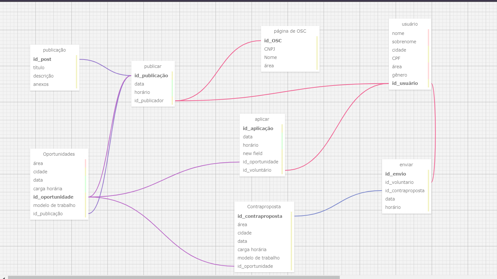

# Ponderada - Modelagem de Banco de Dados Relacional
&nbsp;&nbsp;&nbsp;&nbsp;A presente ponderada tem por objetivo apresentar o desenvolvimento da ponderada de Programação do professor Cristiano Benites referente ao banco de dados relacional e sua modelagem. A atividade foi efetuada pela aluna Kethlen Martins da Silva (turma 11) e foi baseada no projeto em desenvolvimento pelo grupo 1 e que deve ser entregue ao parceiro Parceiros Voluntários. 

## Componentes e elementos do banco de dados
&nbsp;&nbsp;&nbsp;&nbsp;O que compõe um banco de dados são tabelas, chamadas a partir de agora de entidades. No banco de dados, foram criadas tabelas primárias e secundárias, sendo:

- Tabelas primárias: usuário, publicação, oportunidade, contraproposta e página

- Tabelas secundárias: publicar, enviar e aplicar.

## Relacionamentos no banco de dados

&nbsp;&nbsp;&nbsp;&nbsp;No banco de dados supracitado, existem alguns relacionamento que agora serão explicitados:

- usuário - aplicar = (0 -1 ) Um usuário só consegue fazer uma aplicação por vez, mas não é obrigatório que ele o faça.
- usuário - enviar = (0 - 1) Um usuário só consegue fazer um envio por vez, um envio não é obrigatório que ele o faça
- usuário - publicar = (0 - 1) Um usuário só consegue fazer uma publicação por vez, mas não é obrigatório que ele o faça

- OSC - publicar = (0 - 1) Uma OSC só consegue fazer uma publicação por vez, mas não é obrigatório que ela o faça

- Contraproposta - oportunidade = (1-1) uma contraproposta só pode estar em relação com uma oportunidade.

- enviar - Contraproposta = (1-1) um envio só pode estar relacionado com uma contraproposta.

- publicar - post (1-1) = uma publicação só pode estar relacionada com um post por vez.

- publicar - oportunidade (1-1) = uma oportunidade só pode estar relacionada com um post por vez.

- aplicar - vaga = (1-1) uma vaga de oportunidade só pode estar relacionada com uma aplicação por vez. 
